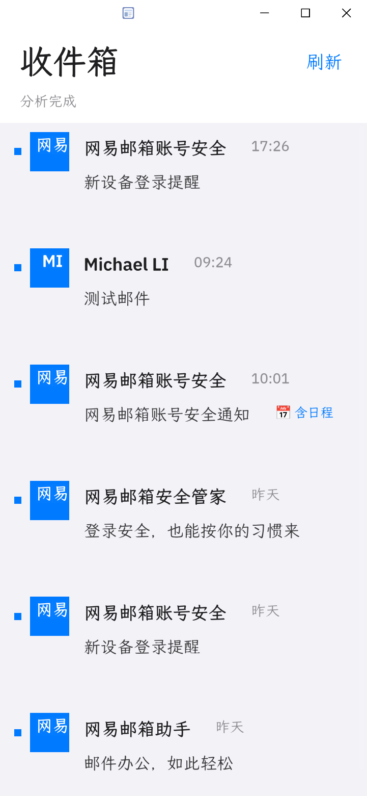

# Agentic Mail - 智能邮件助手

> 让邮件主动为你工作：自动识别日程变更、追踪物流订单、生成回复草稿，一键批准发送。

**GOSIM 2026 Agentic App 黑客松 | 队伍：睿欣达工场**

---

## 核心亮点

### 日程变更检测
自动识别"从 X 改为 Y"句式，高亮对比新旧时间，附原文来源引用。

    放学接送时间：16:00 -> 15:30
    来源："当天放学接送时间将从 16:00 改为 15:30"

### 订单物流追踪
识别订单号、运单号、预计送达时间，可视化物流进度。

    订单 OS-1042 - 运输中
    [已下单] [运输中] [待送达]
    运单号 JD1234567890 - 预计 10月2日

### 智能回复草稿
根据邮件内容自动生成回复，可编辑后一键批准发送，或设置自动批准规则。

### 多场景覆盖
- 会议邀请 - 提取日期/时间/地点
- 安全提醒 - 快速浏览关键信息
- 英文邮件 - 支持中英文混合分析

---

## 应用截图

### 收件箱

- 未读邮件蓝色圆点标记
- 发件人头像 initials 显示
- 时间智能格式（今天 10:01 / 昨天 / 9月29日）
- 日程邮件标签

---

## 技术架构

| 组件 | 说明 |
|---|---|
| **平台** | OctoSense App Hub |
| **语言** | OctoScript (Splash) - AI 原生脚本语言 |
| **能力** | mail（邮件读写）、storage（本地存储） |
| **分析** | 本地文本分析，不依赖外部 AI 服务 |
| **隐私** | 邮件数据不上传，存储仅限设备沙箱 |

### 为什么用 OctoScript？

OctoScript 是 OctoSense 平台的 AI 原生脚本语言，专为大模型生成设计：
- 声明式 UI 组件系统
- 异步事件驱动架构
- 64ms 入口预算保障响应性
- 与 Rust 宿主服务无缝交互

---

## 评审演示路径

### 完整操作链路（3 分钟）

1. **启动应用** - 收件箱列表（未读标记、时间格式）
2. **点击日程邮件** - 阅读器 + 日程变更卡片（红绿对比）
3. **编辑回复草稿** - 批准并发送（或设置自动规则）
4. **点击订单邮件** - 物流追踪卡片（进度可视化）
5. **返回收件箱** - 已处理标记

### 评审要点对照

| 要求 | 本应用实现 |
|---|---|
| 一次完整操作 | 读取->分析->回复，三步成链 |
| 可核对结果 | 日程变更附原文引用，回复基于邮件内容 |
| 失败/空状态 | 空收件箱提示、无日程不显示卡片、网络错误提示 |

---

## Agentic 特性

| 特性 | 实现方式 |
|---|---|
| **主动监控** | 自动同步收件箱，实时分析新邮件 |
| **智能识别** | 关键词 + 模式匹配，提取日程/订单/变更 |
| **跨应用联动** | 邮件->日程->回复，形成完整工作流 |
| **数据聚合** | 统一管理邮件中的日程、物流、待办信息 |

---

## 运行方式

### 评委环境（Rinks 小程序）
维护者通过 hub publish 发布后，评委在 Rinks 中直接运行，无需配置。

### 本地开发
    tools/octo run bundle --port 8141 --detach
    tools/octo shot 8141 bundle/screenshots/01-main.png
    tools/octo check bundle

---

## 项目信息

- **仓库**：https://github.com/mikelgh/agentic-mail
- **版本**：v0.3.0
- **许可证**：Apache-2.0
- **队伍**：睿欣达工场（GOSIM 2026 黑客松）

---

## 致谢

- OctoSense 团队提供平台与工具链
- GOSIM 2026 黑客松组委会
